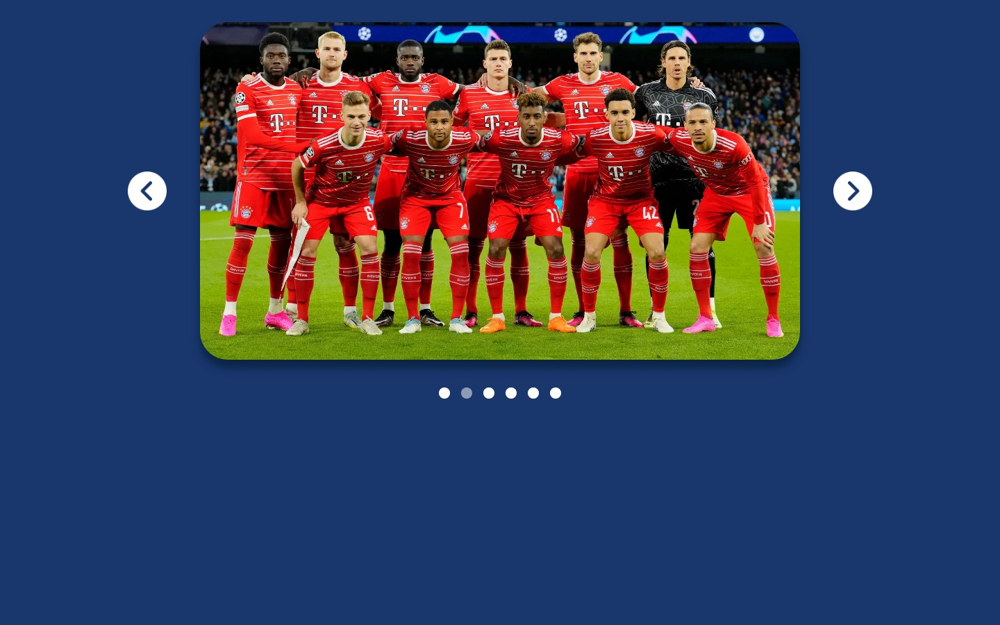

# Basic Carousel App

This is a basic carousel app built using HTML, CSS, and JavaScript. The app allows you to navigate through a series of images by clicking the next or previous buttons.

## Usage

To use the carousel app, follow these steps:

1. Clone or download the repository to your local machine.
2. Open the `index.html` file in your preferred web browser.
3. You will see an initial image displayed in the carousel.
4. Click the "Next" button to move to the next image in the carousel.
5. Click the "Previous" button to move to the previous image in the carousel.

That's it! Enjoy using the basic carousel app.

Feel free to customize the app further to suit your needs by modifying the HTML, CSS, and JavaScript code.
